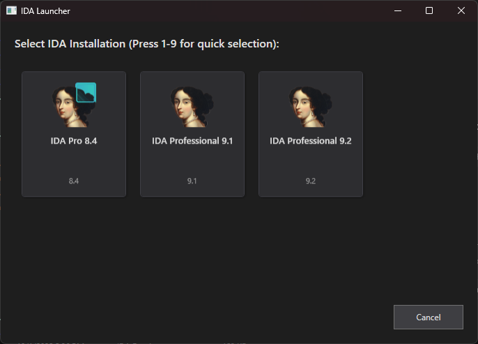

# IDA Picker



A WPF application that allows users to quickly select and launch different IDA installations when opening binary files or IDA project files, useful when you have multiple IDBs that use different versions of IDA. The application automatically detects all installed IDA versions on the system, letting the user pick whatever IDA instance they want to use for the file.

## Requirements

- Windows 10/11
- .NET 9.0 or later
- One or more IDA installations

## Usage

### Basic Usage

Launch the application with a file path as an argument:

```
# Load a sample
ida-picker.exe "C:\malware\sample.exe"

# Load an IDB
ida-picker.exe "C:\malware\sample.exe.i64"

```

The application will:
1. Display all detected IDA installations
2. Show each installation with its icon, name, and version
3. Allow selection via mouse click or keyboard (1-9)
4. Launch the selected IDA version with the specified file

### Theme Support

The application will also automatically checks for the current theme applied on the Windows installation and choose between dark and light mode.

### Keyboard Shortcuts

- **1-9**: Select and launch the corresponding IDA installation
- **Numpad 1-9**: Same as above
- **Esc** or **Cancel button**: Close the application

### Context Menu Integration (Optional)

To integrate with Windows Explorer right-click menu, create a registry entry or use a tool like ShellMenuNew or FileTypesMan to add a "Open with IDA..." option that calls `ida-picker.exe "%1"`.

## License

This project is licensed under the MIT License - see the LICENSE file for details.

## Disclaimer

I vibecoded this.
